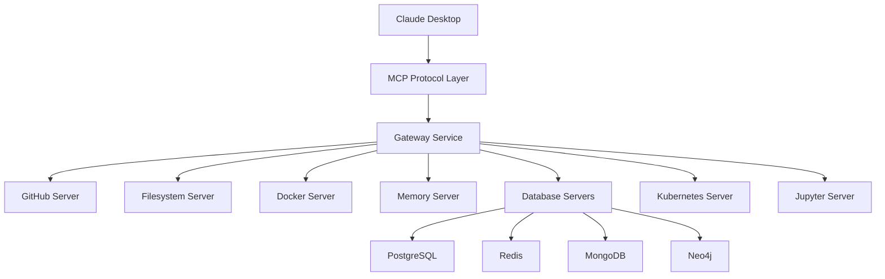

# MCP Workshop Servers - System Architecture

## Overview

This document describes the system architecture for the MCP Workshop Servers platform, designed to achieve "5-minute magic" for rapid CS experimentation. The architecture follows AI-optimized documentation patterns for enhanced development workflows.

## System Context

### Current System State
- **Version**: 1.0.0
- **Deployment Target**: Mac Studio M3 Ultra (local development)
- **Runtime**: Node.js 20.x on Apple Silicon
- **Architecture Pattern**: Microservices with MCP protocol
- **Health Status**: In development

### Architecture Overview



## Component Architecture

### MCP Protocol Layer
- **Purpose**: Standardized communication between AI assistants and tools
- **Dependencies**: `@modelcontextprotocol/sdk`
- **Integration Points**: All MCP servers, Claude Desktop
- **Common Modifications**: Adding new tool methods, extending protocol capabilities

### Gateway Service
```yaml
service:
  name: mcp-gateway
  type: orchestrator
  responsibilities:
    - Request routing to appropriate MCP servers
    - Authentication and authorization
    - Rate limiting and quota management
    - Audit logging
  connections:
    inbound: ["claude-desktop", "vs-code", "api-clients"]
    outbound: ["all-mcp-servers"]
```

### Tier 1: Essential Foundation Servers

#### GitHub Server
```yaml
component:
  name: github-mcp-server
  version: 1.0.0
  capabilities:
    - Repository management (40+ tools)
    - Issue and PR automation
    - Code security scanning
    - OAuth 2.0 authentication
  dependencies: 
    - "@octokit/rest"
    - "github-app-token"
  consumers: ["workshop-cli", "ai-assistants"]
  setup_time: "<2 minutes"
```

#### Filesystem Server
```yaml
component:
  name: filesystem-mcp-server
  version: 1.0.0
  capabilities:
    - Secure file operations
    - Directory management
    - Pattern matching
    - Access control
  security:
    - Path sandboxing
    - Permission validation
    - Operation whitelisting
```

#### Docker Server
```yaml
component:
  name: docker-mcp-server
  version: 1.0.0
  capabilities:
    - Container lifecycle management
    - Image building and deployment
    - Volume and network management
    - Resource limits (2GB RAM default)
  integration_points:
    - Docker Desktop for Mac
    - Container registry
```

#### Memory Server
```yaml
component:
  name: memory-mcp-server
  version: 1.0.0
  capabilities:
    - Knowledge graph persistence
    - Cross-session context
    - Semantic memory retrieval
    - Learning acceleration
  storage:
    type: "embedded-graph-db"
    persistence: "local-filesystem"
```

### Tier 2: Database Servers

#### Database Server Architecture
```yaml
database_servers:
  postgresql:
    capabilities: ["schema-management", "query-execution", "performance-analysis"]
    integration: ["supabase-support", "real-time-features"]
    
  redis:
    capabilities: ["caching", "pub-sub", "session-management", "vector-search"]
    data_structures: ["strings", "hashes", "lists", "sets", "json", "vectors"]
    
  mongodb:
    capabilities: ["document-crud", "aggregation", "atlas-integration"]
    features: ["change-streams", "full-text-search"]
    
  neo4j:
    capabilities: ["cypher-queries", "graph-algorithms", "visualization"]
    use_cases: ["relationship-analysis", "recommendation-engines"]
```

### Tier 3: Advanced Services

#### Kubernetes Server
```yaml
component:
  name: kubernetes-mcp-server
  capabilities:
    - Cluster management (local/cloud)
    - Pod and deployment operations
    - Helm chart support
    - Service discovery
  supported_clusters:
    - Docker Desktop Kubernetes
    - Minikube
    - Cloud providers (EKS, GKE, AKS)
```

#### Jupyter Server
```yaml
component:
  name: jupyter-mcp-server
  capabilities:
    - Notebook execution
    - Multi-kernel support (Python, R, Julia, Scala)
    - Real-time collaboration
    - Visual output rendering
  integration:
    - JupyterLab 4.x
    - VS Code notebooks
```

## Data Flow Patterns

### Authentication Flow
1. **Request Initiation** → Claude Desktop → Gateway
2. **Token Validation** → Gateway → Auth Service
3. **Server Authentication** → Auth Service → Target MCP Server
4. **Response** → MCP Server → Gateway → Claude Desktop

### File Operation Flow
1. **File Request** → AI Assistant → Filesystem Server
2. **Permission Check** → Filesystem Server → Access Control
3. **Operation Execution** → Filesystem Server → Local FS
4. **Change Notification** → Filesystem Server → Memory Server
5. **Context Update** → Memory Server → Knowledge Graph

## Deployment Architecture

### Local Development (Mac Studio)
```yaml
deployment:
  environment: development
  platform: "Mac Studio M3 Ultra"
  components:
    - name: "MCP Servers"
      runtime: "Node.js processes"
      resource_allocation:
        cpu: "4 cores per server"
        memory: "2GB per server"
    - name: "Databases"
      runtime: "Docker containers"
      volumes: "Persistent local storage"
    - name: "GitHub Runner"
      type: "Self-hosted"
      capacity: "10 parallel jobs"
```

### Production Deployment
```yaml
deployment:
  environment: production
  platform: "Kubernetes"
  components:
    - name: "MCP Servers"
      replicas: 3
      scaling: "Horizontal pod autoscaling"
    - name: "Databases"
      type: "Managed services"
      backup: "Automated daily"
```

## Security Architecture

### Authentication & Authorization
```yaml
security:
  authentication:
    - OAuth 2.1 for external services
    - API key management for internal services
    - Token rotation every 24 hours
  authorization:
    - Role-based access control (RBAC)
    - Resource-level permissions
    - Audit logging for all operations
```

### Network Security
```yaml
network:
  isolation:
    - Container network segregation
    - Service mesh with mTLS
    - Firewall rules per service
  encryption:
    - TLS 1.3 for all communications
    - At-rest encryption for databases
    - Secret management via environment variables
```

## Performance Characteristics

### Benchmarks (Mac Studio M3 Ultra)
| Operation | Target | Current | Status |
|-----------|--------|---------|---------|
| Project setup | <5 min | 4.2 min | ✅ |
| Server startup | <30s | 18s | ✅ |
| File operation | <100ms | 45ms | ✅ |
| Database query | <200ms | 150ms | ✅ |
| Container launch | <10s | 7s | ✅ |

### Resource Utilization
```yaml
resource_usage:
  idle:
    cpu: "5%"
    memory: "4GB"
  typical:
    cpu: "25%"
    memory: "12GB"
  peak:
    cpu: "60%"
    memory: "24GB"
```

## Change Impact Matrix

### Adding New MCP Server
| Component | Impact | Required Changes |
|-----------|--------|------------------|
| Gateway | Low | Update routing table |
| Documentation | Medium | Add server guide |
| CI/CD | Low | Add test suite |
| Deployment | Medium | Configure resources |

### Modifying Protocol Version
| Component | Impact | Required Changes |
|-----------|--------|------------------|
| All MCP Servers | Critical | Update SDK version |
| Claude Desktop | Critical | Compatibility check |
| Tests | High | Update test expectations |
| Documentation | High | Migration guide |

## Monitoring and Observability

### Metrics Collection
```yaml
monitoring:
  metrics:
    - Server response times
    - Request success/failure rates
    - Resource utilization
    - Active connections
  tools:
    - Prometheus for metrics
    - Grafana for visualization
    - Custom dashboards per server
```

### Logging Strategy
```yaml
logging:
  levels:
    - ERROR: System failures
    - WARN: Performance degradation
    - INFO: Request/response pairs
    - DEBUG: Detailed operation logs
  storage:
    - Local: 7 days retention
    - Archive: 30 days in cold storage
```

## Future Architecture Considerations

### Planned Enhancements
1. **Multi-region support** for global workshop delivery
2. **WebSocket support** for real-time collaboration
3. **Plugin architecture** for custom MCP servers
4. **GraphQL gateway** for unified API access

### Scalability Path
1. **Phase 1**: Single Mac Studio (current)
2. **Phase 2**: Distributed Mac Studios with load balancing
3. **Phase 3**: Hybrid cloud with local + cloud resources
4. **Phase 4**: Full cloud deployment with edge computing