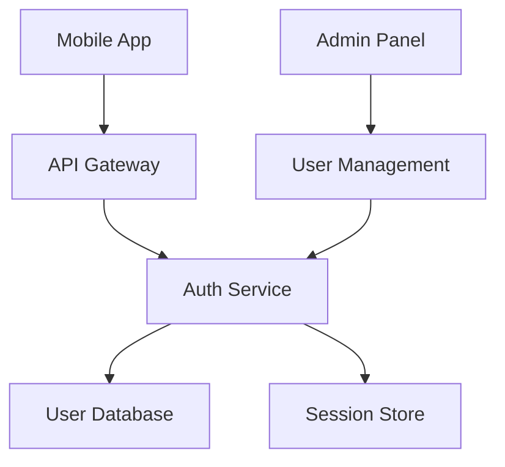

# AI-Optimized Documentation Architecture Guide

**Comprehensive best practices for restructuring technical documentation to optimize AI-assisted development workflows**, specifically designed for Mac-based hobby server projects using git and Cursor IDE. This research synthesizes insights from leading companies, open-source projects, and specialized AI documentation tools to provide immediately implementable solutions.

## Structure Framework: Building AI-Readable Documentation Architecture

**Modern documentation succeeds when it serves both human developers and AI assistants effectively**. The optimal folder hierarchies combine logical organization with AI-friendly naming conventions and rich metadata schemas that enable intelligent parsing and cross-referencing.

### Optimal folder hierarchies for AI consumption

The most effective structure follows a **layered approach** that prioritizes frequently accessed content while maintaining clear separation of concerns:

```
project-root/
├── docs/                    # Primary documentation hub
│   ├── setup/              # Installation and configuration guides
│   ├── api/                # API documentation and references  
│   ├── guides/             # How-to guides and tutorials
│   ├── troubleshooting/    # Problem-solving documentation
│   ├── examples/           # Code examples and samples
│   ├── assets/             # Images, diagrams, videos
│   ├── templates/          # Document templates
│   └── ai/                 # AI-specific context and prompts
├── .cursor/                # Cursor IDE configuration
│   └── rules/              # AI behavior rules and patterns
├── src/                    # Source code with inline documentation
├── README.md               # Project overview with AI context
└── ARCHITECTURE.md         # System design and relationships
```

**AI-optimized naming conventions** follow specific principles that dramatically improve comprehension: **unique file names** rather than generic ones (use `user-authentication-guide.md` instead of `auth.md`), **kebab-case consistency** throughout all files, and **descriptive paths** that include full context. Cursor IDE specifically benefits from this approach, as it can better understand component relationships when file names clearly indicate their purpose and scope.

### Document templates with embedded AI context

**Setup guide template** integrates structured metadata with contextual information:

```markdown
---
title: "Setup Guide - Authentication Service"
type: "setup"
difficulty: "intermediate"
estimated_time: "20 minutes"
prerequisites: ["node-js-installation", "database-setup"]
tags: ["setup", "authentication", "security"]
ai_context:
  purpose: "Establishes secure user authentication for the platform"
  dependencies: ["user-database", "session-store", "email-service"]
  integration_points: ["api-gateway", "frontend-auth"]
last_updated: "2025-01-15"
---

# Authentication Service Setup Guide

## Overview
This service handles user authentication, session management, and security tokens for the entire platform, processing approximately 50,000 authentication requests daily.

## System Context
The Authentication Service operates as the primary security gateway, implementing OAuth 2.0 + OpenID Connect protocols. All requests requiring authentication pass through this service before reaching downstream components.

### Current System State
- **Version**: 2.1.4
- **Deployment**: Kubernetes cluster (3 replicas)
- **Database**: PostgreSQL 14.x with Redis session store
- **Health Status**: All systems operational
```

**API documentation template** emphasizes relationship mapping and integration patterns:

```markdown
---
title: "User Management API"
type: "api-reference"
http_method: "POST"
endpoint: "/api/v1/users"
dependencies: ["auth-service", "user-database", "notification-service"]
consumers: ["admin-panel", "mobile-app", "analytics-service"]
---

# User Management API

## Integration Points
- **Depends on**: [Authentication Service](../auth/overview.md) for token validation
- **Used by**: [Admin Dashboard](../admin/dashboard.md), [Mobile App](../mobile/user-flows.md)
- **Related**: [Notification Service](../notifications/overview.md) for user communications

## Common Modification Patterns
```javascript
// Adding new user fields - update these components:
// 1. Database schema: migrations/add-user-field.sql
// 2. API response: models/User.js
// 3. Frontend forms: components/UserForm.tsx
// 4. Validation: validators/userValidator.js
```
```

### Cross-reference systems for component mapping

**Component relationship database** provides machine-readable dependency mapping:

```yaml
# .cross-references.yaml
components:
  user-authentication:
    file: "docs/auth/authentication.md"
    dependencies: ["database", "redis-cache"]
    consumers: ["user-management", "api-gateway"] 
    integration_points:
      - endpoint: "/auth/validate"
        consumers: ["all-protected-routes"]
      - events: ["auth:success", "auth:failure"]
        listeners: ["audit-service", "analytics"]
    
relationships:
  - source: "user-authentication"
    target: "session-management"
    type: "implements"
    description: "Authentication service manages user sessions"
    impact_level: "critical"
```

**Visual dependency mapping** uses Mermaid diagrams for AI-parseable architecture visualization:

```markdown
## System Architecture Overview

```

## Content Strategy: Writing for AI Understanding

**Effective AI-friendly content provides explicit context rather than implicit assumptions**, uses structured information blocks, and maintains comprehensive detail that helps AI models understand system state and architectural relationships without requiring external knowledge.

### Context blocks for system state documentation

**Comprehensive system context template**:

```markdown
## Current System Architecture Context

### Service Mesh Overview
```yaml
services:
  auth-service:
    replicas: 3
    resources:
      cpu: "500m"  
      memory: "1Gi"
    connections:
      inbound: ["api-gateway", "admin-portal"]
      outbound: ["user-db", "session-store"]
    current_load: "85% capacity during peak hours"
    
operational_state:
  peak_hours: "9AM-5PM EST weekdays"
  avg_response_time: "150ms"
  error_rate: "<0.1%"
  cache_hit_rate: "85%"
```

### Data Flow Context
1. **Authentication Request** → API Gateway → Auth Service  
2. **User Validation** → Auth Service → User Database
3. **Session Creation** → Auth Service → Session Store
4. **Token Generation** → Auth Service → JWT (24hr expiry)
5. **Response** → Auth Service → API Gateway → Client
```

### Dependency documentation for AI consumption

**SPDX-compatible dependency export** provides standardized machine-readable dependency information:

```json
{
  "manifest": {
    "name": "hobby-server-platform",
    "version": "1.0.0"
  },
  "dependencies": {
    "direct": [
      {
        "name": "auth-service",
        "version": "2.1.4",
        "type": "service",
        "relationship": "provides-authentication",
        "criticality": "high",
        "sla_dependency": true
      }
    ]
  },
  "relationships": {
    "service_mesh": [
      {
        "source": "api-gateway",
        "target": "auth-service", 
        "type": "http",
        "protocol": "REST",
        "health_check": "/health"
      }
    ]
  }
}
```

### Architectural Decision Records optimized for AI tools

**MADR template** with enhanced AI context:

```markdown
# ADR-0001: GraphQL API Gateway Implementation

## Status
Accepted

## Context and Problem Statement
Our microservices architecture currently uses REST APIs for inter-service communication. As we scale to 15+ services, we experience API versioning complexity, over-fetching issues, and integration overhead that has decreased development velocity by 40%.

## Decision Drivers
- **Performance**: Reduce mobile bandwidth usage by 60%
- **Type Safety**: Strong typing for frontend development  
- **Maintainability**: Centralized schema management
- **Developer Experience**: Single endpoint for complex queries

## Decision Outcome
**Chosen option**: GraphQL Federation

**Implementation Plan**:
1. **Phase 1** (Weeks 1-2): Federation gateway infrastructure
2. **Phase 2** (Weeks 3-6): Migrate auth and user services
3. **Phase 3** (Weeks 7-10): Frontend integration
4. **Phase 4** (Weeks 11-12): Production rollout

## Change Impact Assessment
| Affected Component | Impact Level | Required Changes |
|-------------------|--------------|------------------|
| Frontend Apps | High | Update data fetching patterns |
| Mobile Client | Medium | Implement GraphQL client |
| API Gateway | Critical | Complete replacement |
| Auth Service | Low | Schema definition only |

**Rollback Strategy**: Maintain REST endpoints for 90 days post-migration
```

## AI Collaboration Features: Cursor IDE Integration

**Cursor IDE excels with structured documentation that provides clear entry points, modification patterns, and change impact guidance**. The most effective approach combines project-specific rules with prompt-ready documentation sections that guide AI suggestions.

### Cursor IDE configuration for documentation workflows

**Project rules structure** (`.cursor/rules/`):

```markdown
---
description: Documentation Standards for AI Context
globs:
- docs/**/*.md
- src/**/*.ts
- src/**/*.tsx
alwaysApply: true
---

# Project Documentation Rules

## Documentation Standards
- Use kebab-case for all file names
- Include AI context blocks in all major components
- Maintain cross-reference metadata in frontmatter
- Follow the three-module pattern: Concept, Procedure, Reference

## Component Documentation Pattern
Every component must include:
- Purpose and scope definition
- Dependencies and integration points  
- Common modification patterns
- Change impact assessment
- Testing requirements

## AI Context Requirements
- Provide system state information
- Document relationships between components
- Include example modifications
- Specify testing patterns
```

### Prompt-ready documentation sections

**Component modification template**:

```markdown
# User Authentication Component

## AI Context for Modifications
This component handles user login flows and session management. Common modifications include:

### Adding New Authentication Provider
```typescript
// 1. Extend AuthProvider interface
interface AuthProvider {
  name: string;
  authenticate: (credentials: any) => Promise<AuthResult>;
  // Add new provider-specific methods here
}

// 2. Update provider registry
const providers = {
  local: new LocalAuthProvider(),
  google: new GoogleAuthProvider(),
  // Add new provider instance here
}

// 3. Update frontend provider selection
const AuthProviderSelector = () => (
  <select>
    <option value="local">Local</option>
    <option value="google">Google</option>
    {/* Add new provider option */}
  </select>
)
```

### Modifying User Validation Rules
```javascript
// Location: src/auth/validators/userValidator.js
// Pattern: Add new validation rules to ValidationSchema
const validationRules = {
  email: [required, validEmail],
  password: [required, minLength(8), strongPassword],
  // Add new validation rules here
}
```

## Integration Points Where AI Can Suggest Improvements
- **Performance optimization**: Session caching strategies
- **Security enhancements**: Multi-factor authentication
- **User experience**: Progressive authentication flows
- **Monitoring**: Authentication success/failure tracking
```

### Change impact documentation formats

**System-level change impact template**:

```markdown
# Change Impact Analysis: Authentication Service Migration

## Blast Radius Assessment
### Direct Dependencies (Will Break)
- **API Gateway**: Authentication header validation logic
- **Session Management**: Token format compatibility  
- **User Service**: User lookup and validation patterns

### Indirect Dependencies (May Be Affected)  
- **Admin Dashboard**: User management interface
- **Analytics Service**: User tracking and segmentation
- **Notification Service**: User preference retrieval

## Risk Matrix
| Change Type | Affected Services | Risk Level | Mitigation |
|------------|------------------|------------|------------|
| Token format change | All services | Critical | Gradual rollout with dual support |
| API endpoint changes | Frontend, Mobile | High | Version compatibility layer |
| Database schema | User Service | Medium | Migration scripts with rollback |

## Testing Requirements
- **Unit Tests**: Authentication logic components
- **Integration Tests**: Service-to-service communication
- **E2E Tests**: Complete user authentication flows
- **Performance Tests**: Authentication under load

## Rollback Plan
1. **Immediate**: Switch traffic back to previous version
2. **Database**: Rollback migration scripts available  
3. **Configuration**: Previous environment settings preserved
4. **Validation**: Health checks confirm system stability
```

## Implementation Strategies: From Scattered to Structured

**Successful documentation restructuring requires phased migration, automated maintenance, and robust quality gates**. The most effective implementations focus on incremental improvements while maintaining existing workflows during transition.

### Migration strategies with minimal disruption

**Phased migration approach**:

**Phase 1: Foundation** (Weeks 1-2)
- Audit existing documentation using analytics to identify high-traffic content
- Set up git repository structure with AI-optimized folder hierarchy
- Create document templates with embedded metadata schemas
- Implement basic GitHub Actions workflow for automated validation

**Phase 2: Content Migration** (Weeks 3-6)  
- Convert high-priority documentation to structured markdown format
- Implement cross-reference system with component relationship mapping
- Set up automated quality gates using Vale for style guide compliance
- Train team on new documentation workflows and AI integration patterns

**Phase 3: AI Integration** (Weeks 7-8)
- Configure Cursor IDE rules for project-specific documentation standards
- Implement automated documentation generation from code comments
- Set up change impact tracking and notification systems
- Optimize content based on AI interaction patterns and usage analytics

### Automation opportunities for continuous maintenance

**GitHub Actions workflow** for comprehensive documentation automation:

```yaml
name: Documentation Pipeline
on:
  push:
    branches: [main]
    paths: 
      - 'src/**'
      - 'docs/**'
      - 'api/**'

jobs:
  documentation-pipeline:
    runs-on: ubuntu-latest
    steps:
      - uses: actions/checkout@v4
      
      - name: Generate API Documentation
        run: |
          # Extract from OpenAPI specifications
          swagger-codegen generate -i api/openapi.yaml -l html2 -o docs/api/
          
      - name: Extract Code Documentation
        run: |
          # Generate from JSDoc comments
          jsdoc src/ -d docs/code/ -R README.md
          
      - name: Update Architecture Diagrams  
        run: |
          # Auto-generate dependency graphs
          madge --image docs/dependency-graph.png src/
          
      - name: Content Quality Validation
        run: |
          # Style guide compliance
          vale docs/
          # Link validation
          markdown-link-check docs/**/*.md
          
      - name: Deploy Documentation
        env:
          DEPLOY_KEY: ${{ secrets.DEPLOY_KEY }}
        run: |
          # Deploy to documentation platform
          npm run deploy:docs
```

### Git workflow integration with quality gates

**Pre-commit hooks** for documentation quality:

```bash
#!/bin/bash
# .git/hooks/pre-commit

# Vale style guide compliance
vale docs/ || exit 1

# Markdown format validation  
markdownlint docs/**/*.md || exit 1

# Link checking
markdown-link-check docs/**/*.md || exit 1

# Spell checking
cspell "docs/**/*.md" || exit 1

echo "Documentation validation passed ✓"
```

**Quality gate implementation** with automated enforcement:

```yaml
# .github/workflows/quality-gates.yml
name: Documentation Quality Gates
on: [pull_request]

jobs:
  validate-docs:
    runs-on: ubuntu-latest
    steps:
      - uses: actions/checkout@v4
      
      - name: Vale Style Compliance
        uses: errata-ai/vale-action@v2
        with:
          styles: .vale/styles
          config: .vale.ini
          
      - name: Check Required Sections
        run: |
          # Verify all components have required documentation
          python scripts/validate-docs-completeness.py
          
      - name: Performance Validation
        run: |
          # Ensure documentation builds complete within time limits
          timeout 5m npm run build:docs
```

## Real-World Examples: Learning from Industry Leaders

**Leading companies and open-source projects demonstrate specific patterns that optimize documentation for both human developers and AI assistants**. These examples provide concrete templates and structural approaches that can be immediately adapted for hobby server projects.

### Open source projects with exemplary AI-friendly structures

**Red Hat's Modular Documentation Framework** provides the most comprehensive template for structured technical documentation:

```
modular-docs/
├── assemblies/              # Complete user workflows
│   ├── assembly-getting-started.adoc
│   ├── assembly-advanced-configuration.adoc
│   └── assembly-troubleshooting.adoc
├── modules/                 # Reusable content blocks
│   ├── con-authentication-concepts.adoc      # Concept modules
│   ├── proc-setup-authentication.adoc       # Procedure modules
│   └── ref-configuration-options.adoc       # Reference modules
├── common-content/          # Shared attributes and variables
│   └── attributes.adoc
└── images/                  # Visual assets
```

**File naming conventions** follow structured patterns:
- `con-concept-name.adoc` for conceptual information
- `proc-procedure-name.adoc` for step-by-step instructions  
- `ref-reference-name.adoc` for reference material
- `assembly-assembly-name.adoc` for complete workflows

**Module structure template**:

```markdown
[id="user-authentication_{context}"]
= User Authentication Service

This service handles secure user login, registration, and session management for the platform.

== Authentication flow

The authentication process follows OAuth 2.0 standards:

1. User submits credentials to login endpoint
2. Service validates against user database  
3. JWT token generated with 24-hour expiration
4. Session stored in Redis for fast validation
5. Token returned to client for subsequent requests

== Configuration options

include::ref-auth-configuration-options.adoc[]

== Related information

* link:assembly-user-management.html[User Management Guide]
* link:assembly-api-security.html[API Security Overview]
```

### Company examples of AI-assisted development documentation

**Stripe's API documentation architecture** demonstrates optimal integration of human-readable and AI-parseable content:

```markdown
# Payment Intents API

## Quick Start for AI Context
This endpoint creates payment intents representing customer payment collection. 

### Prerequisites Context
- ✅ **API Keys**: Live and test mode configured
- ✅ **Webhooks**: Payment status update endpoints  
- ✅ **Client Integration**: Stripe.js implemented
- ✅ **Compliance**: PCI requirements met

## Current API State
- **Version**: 2024-11-20
- **Rate Limits**: 100 requests/second per API key
- **Uptime**: 99.99% (past 30 days)
- **Response Time**: <150ms average

## Integration Patterns
### Most Common Implementation (85% of integrations)
```javascript
// Webhook-first approach with automatic payment confirmation
const paymentIntent = await stripe.paymentIntents.create({
  amount: 2000,
  currency: 'usd',
  confirm: true,
  payment_method: 'pm_card_visa'
});
```

### Advanced Pattern for Complex Flows  
```javascript
// Multi-step flow with customer confirmation
const paymentIntent = await stripe.paymentIntents.create({
  amount: 2000,
  currency: 'usd',
  setup_future_usage: 'off_session'
});
// Client-side confirmation with 3D Secure handling
```
```

**Docker's AI-Enhanced Documentation** serves 13 million monthly visitors through Kapa.ai integration:

- **Contextual AI Assistant**: Provides instant answers from comprehensive technical documentation
- **Error Message Debugging**: AI helps resolve specific Docker error scenarios  
- **Multilingual Support**: Documentation automatically adapted for global developer community
- **Usage Analytics**: AI interaction patterns inform documentation improvements

### Documentation frameworks designed specifically for AI consumption

**Kapa.ai Platform Architecture**:
- **Source Integration**: 40+ connectors (Markdown, Confluence, GitHub, Discourse)
- **AI Processing**: LLM-powered semantic understanding of technical content
- **Deployment Options**: Website widgets, Slack bots, Discord integration, REST APIs
- **Analytics**: Documentation gap identification and usage pattern analysis

**Implementation for hobby projects**:

```yaml
# kapa-config.yml
project:
  name: "Hobby Server Platform"
  description: "Personal server infrastructure with modern development workflows"
  
sources:
  - type: github
    repository: "username/hobby-server"
    paths: ["docs/", "README.md", "ARCHITECTURE.md"]
    
  - type: markdown
    directory: "docs/"
    recursive: true
    
ai_configuration:
  context_window: 16000
  response_style: "technical_detailed"
  include_code_examples: true
  
deployment:
  widget_integration: true
  slack_bot: false
  api_access: true
```

### Modular, searchable documentation structures with concrete examples

**Assembly-based content architecture**:

```markdown
# Installing Authentication Service

## Overview
Complete setup guide for implementing secure user authentication in your hobby server project.

## Prerequisites  
include::modules/con-system-requirements.adoc[]
include::modules/con-security-considerations.adoc[]

## Installation procedures
include::modules/proc-database-setup.adoc[]
include::modules/proc-service-installation.adoc[] 
include::modules/proc-initial-configuration.adoc[]

## Verification and testing
include::modules/proc-testing-authentication.adoc[]
include::modules/proc-security-validation.adoc[]

## Next steps
- [Production Configuration](assembly-production-setup.html)
- [User Management Integration](assembly-user-management.html)
- [API Security Implementation](assembly-api-security.html)
```

**Content modules for maximum reusability**:

```markdown
// modules/proc-database-setup.adoc
[id="database-setup_{context}"]
= Setting up the authentication database

.Prerequisites
* PostgreSQL 14+ installed and running
* Database user with CREATE permissions
* Network connectivity configured

.Procedure
1. Create authentication database:
   ```sql
   CREATE DATABASE auth_service;
   CREATE USER auth_user WITH PASSWORD 'secure_password';
   GRANT ALL PRIVILEGES ON DATABASE auth_service TO auth_user;
   ```

2. Apply database schema:
   ```bash
   psql -U auth_user -d auth_service -f schema/authentication.sql
   ```

3. Verify table creation:
   ```sql
   \dt
   -- Should show: users, sessions, auth_tokens tables
   ```

.Verification
Run the database health check:
```bash
npm run db:health-check
```

.Troubleshooting
If connection fails, verify:
* Database service is running: `systemctl status postgresql`
* Network connectivity: `telnet localhost 5432`
* User permissions: Check `pg_hba.conf` configuration
```

This comprehensive research provides immediately implementable frameworks, templates, and strategies for creating AI-optimized technical documentation that enhances both human developer productivity and AI-assisted development workflows. The modular approach enables gradual implementation while maintaining existing documentation during transition periods.