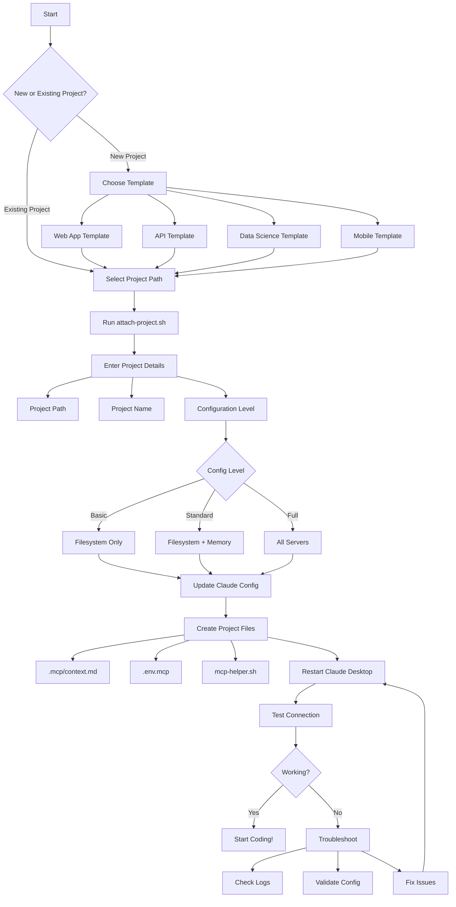

# Project Attachment Flow

## Visual Flow Diagram



## Step-by-Step Process

### 1. Choose Your Project
- **New Project**: Select a template (web-app, api, data-science, mobile)
- **Existing Project**: Navigate to your project directory

### 2. Run Attachment Script
```bash
./scripts/attach-project.sh
```

### 3. Configure Project
- **Project Path**: Full path to your project directory
- **Project Name**: Unique identifier for memory segregation
- **Config Level**:
  - Basic: Filesystem access only
  - Standard: Filesystem + Memory (recommended)
  - Full: All servers including GitHub, Docker, databases

### 4. Automatic Setup
The script will:
- Back up existing Claude config
- Add MCP server configurations
- Create project metadata files
- Set up helper scripts

### 5. Restart and Test
- Quit Claude Desktop completely
- Reopen Claude Desktop
- Test with: "List files in my project"

## Configuration Examples

### Basic Setup
```json
{
  "mcp-filesystem-myapp": {
    "command": "npx",
    "args": ["-y", "@modelcontextprotocol/server-filesystem", "/path/to/project"]
  }
}
```

### Standard Setup
```json
{
  "mcp-filesystem-myapp": { ... },
  "mcp-memory-myapp": {
    "command": "node",
    "args": ["path/to/memory/server"],
    "env": {
      "MEMORY_PROJECT": "myapp"
    }
  }
}
```

### Full Setup
```json
{
  "mcp-filesystem-myapp": { ... },
  "mcp-memory-myapp": { ... },
  "mcp-github": { ... },
  "mcp-docker": { ... },
  "mcp-postgresql": { ... }
}
```

## Common Patterns

### Single Developer, Single Project
- Use standard setup (filesystem + memory)
- Simple project name
- Default paths

### Multiple Projects
- Use project-specific server names
- Separate memory contexts
- Consider workspace organization

### Team Development
- Standardize project names
- Use shared templates
- Document conventions in .mcp/context.md

### CI/CD Integration
- Export configs to environment
- Use memory for build context
- Track deployment history